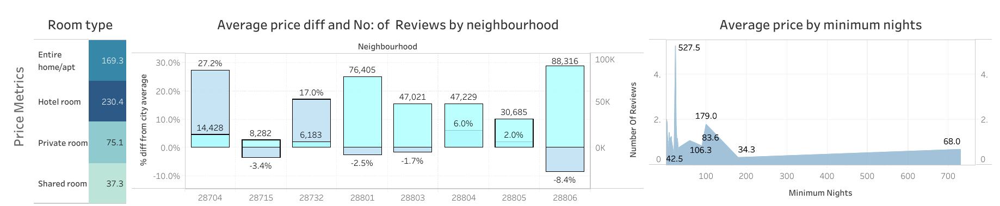
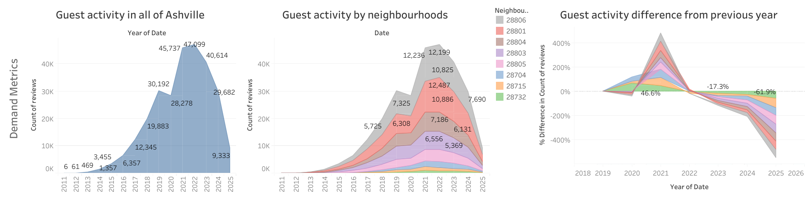
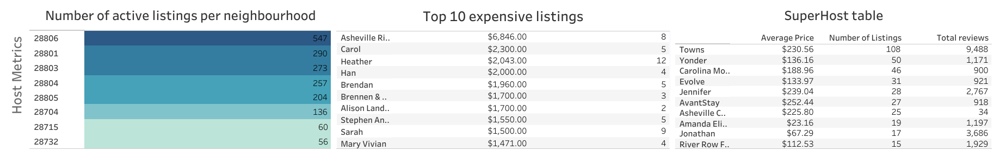

# Ashville_AirBNB_Listings_Analysis

## Project Background

A Travel research firm that operates within the travel and hospitality technology sector specializing in leveraging large-scale public and proprietary datasets to derive actionable market insights.

The primary objective of this project undertaken by the travel research firm is to analyse the publicly available AirBnb data to provide critical insights for a travel startup client guiding their executive decision on whether to expand services in Ashville, NC.

Insights and recommendations are provided on the following key areas:

- Pricing insights: Evaluation of prices of listings(rooms) per night from 2011 to half of 2025 in Ashville,NC, focusing on Prices of listings, Avereage price of different Ashville neighbourhoods and Average  minimum night prices. 
- Demand analysis:Identification of High-Growth neighbourhoods and peak activity periods(Monthly/Annual) to determine market viability and optimal timing for service expansion.
- Host Analysis: Analysing Hosts and their pricing patterns, Number of listings per host and their activity based on reviews by guest to better understand the influence of hosts on the market.

First part of cleaning was done using Excel.

The SQL queries utilised load,clean and maintain data integrity can be found [here](load_clean.sql)

The SQL queries utilised for descriptive analysis can be found [here](descriptive_analysis.sql)

The SQL queries utilised to load raw data for enquiry can be found [here](load_rawdata.sql)

The SQL queries to answer business questions can be found [here](queries.sql)

## Data Structure

Ashville's AirBNB data as seen below consists of 3 tables, raw_listings, listings and reviews with a total rown count of 3,18,549.

## Executive Summary

### Overview of Findings

After peaking in 2022 Ashville's guest activity saw a -13.77% decline in 2023.Halfway through 2025 the decline continues.This decline can be attributed to pre-pandemic normalcy.The peak guest activity happens during the month of september.There is some correlation between average prices of each neighbourhoods and guest activity there.Superhosts continues to shine.Hotel room's are the costliest of all the rooms listed.
The following sections will explore additional contributing factors and highlight key oppurtunity areas for improvement.

Examples are included throughout the report.The entire dashboard can be downloaded [here](vizzs/airbnbash.png).

### Pricing Analysis:

  - The neighbourhoods with average prices lower than the whole city average accounts for 86.82% of guest activity.
  - Hotel rooms are the most expensive and shared rooms are the least expensive.Entire home/apt accounts for 90.98% of guest activity even with
    average price of 183.12,where hotel rooms accounts for only 0.103% of guest activity.
  - Most listings provide 1,2,3,30 minimum nights.And for the 99.014% of listings average prices decreases as number of minimum nights increases.
  - The price of rooms listed start from $18 to $6846.

  

### Demand Analysis

  - Guest Activity peaked in 2022.Then in 2023 all neighborhoods in Ashville saw a total -13.77% decline.2024 saw - 26.92% decline from previous year.
    The decline trend continues halfway through 2025.
  - The most popular neighbourhoods in Ashville are 28801 and 28806,both these saw -12.79% and -9.97% decline in guest activity during 2023.From 2023
     to 2024 neighbourhoods 28801 saw -23.64% and 28806 saw -28.45% decline in guest activity.
  - No neighbourhoods saw any kind of growth after the year 2022.
  - The month of september is where highest activity occur.

  

### Host Analysis

 - The host which has most number of listings is Towns which has 108 listings all over Ashville and over 9000 reviews,Host Yonder has 50 listings and has over 1000 reviews.
 - Hosts which has over 30 listings and over 1000 reviews(Although only few of these are there) charges 57% more than other hosts which are considered average performing.
 - The most expensive listing's guest activity is very low.

## Recommendations:

Based on the uncovered insights, the following recoemmendations have been provided:

 - The neighbourhoods with average prices lower than the whole city average accounts for 86.82% of guest activity and 90.98% guests choose entire home/apt.So `lower prices attracts
   more guests and rooms listed as entire home/apt are more popular in Ashville.`
 - Expensive listing's guest activity is very low, so maybe `to increase guest activity lowering prices or more marketing to appropriate audience might be beneficial.`
 - Guest Activity peaked in 2022.Then in 2023 all neighborhoods in Ashville saw a total -13.77% decline.2024 saw - 26.92% decline from previous year.
    The decline trend continues halfway through 2025.This decline can be attributed to post-pandemic normalcy, but `if further data suggests even more decline then a deep
    look into what might be the reason will be good idea before expanding AirBnb activity in Ashville.`
 - The months september and july are the peak guest activity months, July is ideal for hiking and during september Ashville community hosts cultural fests and 
   guests can enjoy activities like apple picking and touring farm.
 - The neighbourhoods with highest guest activity are 28806 and 28801, they both account for 52.87% of guest activity in all of Ashville.Both of these neighbourhoods provide prices
    lesser than Ashville city average.But the steady decline after 2022 is a little bit concerning and need further enquiry.`If any market expansion is planned it should be in these
    neighbourhoods.`
 - The guest activity in `neighbourhoods 28715 and 28732 is very low and data shows they are not good places for market expansion.`
 - Some hosts can be considered Superhosts as they provide many listings and have good guest activity.Some of them are: Towns with 108 listings and over 9000 reviews,Then Yonder
   with 50 listings and over 1000 reviews.`These types of Superhosts are rare and it will be beneficial to enquire into how these listings became a popular tourist attraction and
   use that findings to build more superhosts.`
