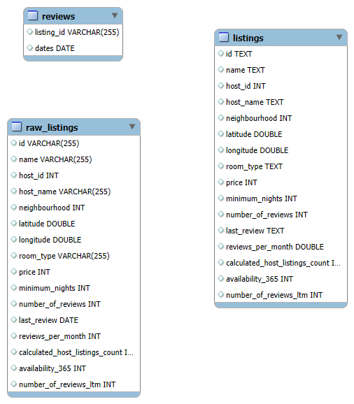

# Ashville_AirBNB_Listings_Analysis

## Project Background

A Travel research firm that operates within the travel and hospitality technology sector specializing in leveraging large-scale public and proprietary datasets to derive actionable market insights.

The primary objective of this project undertaken by the travel research firm is to analyse the publicly available AirBnb data to provide critical insights for a travel startup client guiding their executive decision on whether to expand services in Ashville, NC.

Insights and recommendations are provided on the following key areas:

- Pricing insights: Evaluation of prices of listings(rooms) per night from 2011 to half of 2025 in Ashville,NC, focusing on Prices of listings, Avereage price of different Ashville neighbourhoods and Average  minimum night prices. 
- Demand analysis:Identification of High-Growth neighbourhoods and peak activity periods(Monthly/Annual) to determine market viability and optimal timing for service expansion.
- Host Analysis: Analysing Hosts and their pricing patterns, Number of listings per host and their activity based on reviews by guest to better understand the influence of hosts on the market.

First part of cleaning was done using Excel.

The SQL queries utilised load,clean and maintain data integrity can be found [here](load_clean.sql)

The SQL queries utilised for descriptive analysis can be found [here](descriptive_analysis.sql)

The SQL queries utilised to load raw data for enquiry can be found [here](load_rawdata.sql)

The SQL queries to answer business questions can be found [here](queries.sql)

## Data Structure

Ashville's AirBNB data as seen below consists of 3 tables, raw_listings, listings and reviews with a total rown count of 3,18,549.

